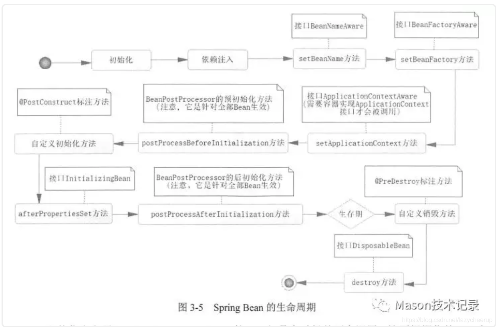
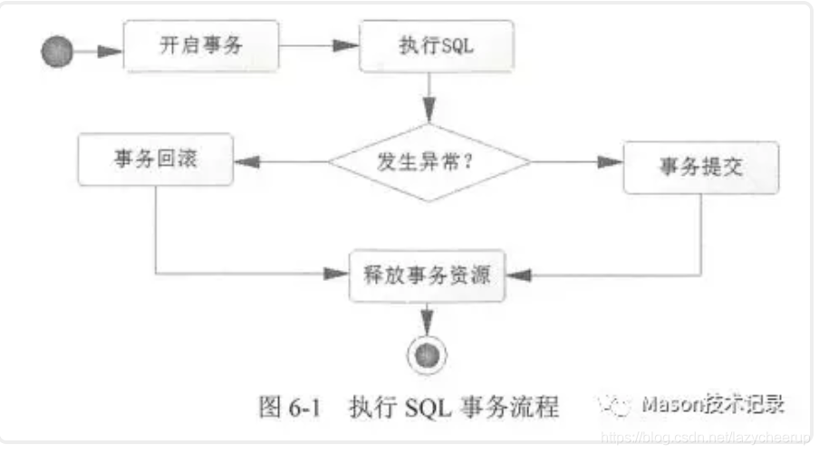
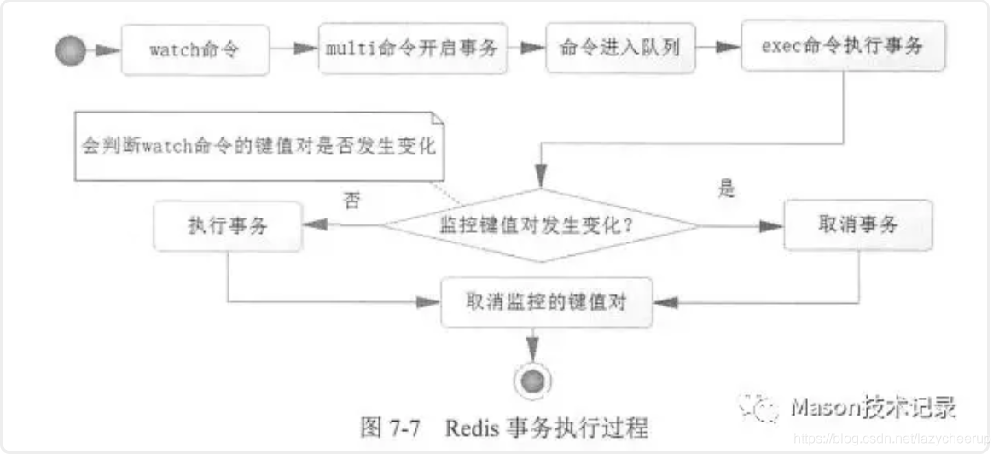
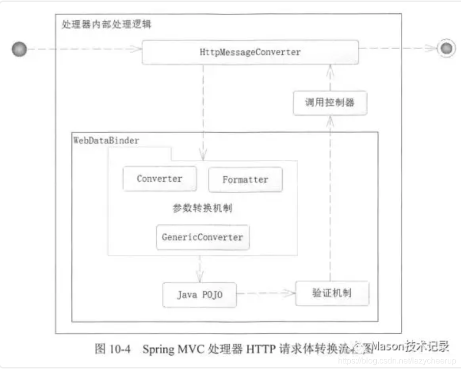

## 深入浅出Spring Boot 2.x》读书笔记(抄的)
[原版](https://blog.csdn.net/lazycheerup/article/details/88414064)
#### 整体感受
这是一本讲述如何使用Spring Boot 2.x进行编程开发的技术书籍，全书围绕Spring Boot进行讲解，并且提供编程示例，示例简单易懂，而且作者确实是有相当丰富的开发经验，文章语言流畅，既讲到编程技术也对其中的原理有较好的描述，让读者知其然也知其所以然。其中重点对Spring MVC的使用进行了大篇幅的讲解，比较透彻。通过此书，基本对Spring Boot的Web开发有了整体了解，作为入门级的Spring Boot学习书籍，值得一读。

#### 内容提纲
对于Spring的web开发，围绕的开发内容基本是属于Spring MVC，数据库访问，缓存处理，安全，分布式应用几个范畴，因此，书的大体结构也是分这几大部分，如下：

全书从Spring Boot的出现开始讲起，到基本的环境搭建，进而对Spring的IOC及AOP进行详细讲解。以此作为理论基础，接着进行数据库访问、Redis集成、MongoDB集成的开发，然后重点讲解了Spring MVC的开发。后面对Spring Security、REST风格、WebFlux、部署及监控，Spring Cloud进行了初步的介绍和使用。

下面对我读完后个人认为挺重要的内容做了个粗略的记录，也提醒自己在使用Spring Boot的过程中注意一下。

#### Spring Boot发展
回顾java web的开发，从最初的自己编写Servlet进行mapping，到后来Spring的引入而使用Struct，然后后来直接使用Spring MVC，通过XML配置实现web相关组件注入开发。再后来变成Spring MVC的注解方式进行装配，然后发展到现在Spring Boot，以全注解，自动装配的方式实现开发。基本经历这几波：

Spring MVC xml装配 -> Spring MVC Servlet3.0注解装配 -> Spring Boot全注解自动装配。

#### Spring IOC 及AOP
Spring Boot是基于Spring的，Spring的核心是IOC和AOP，因此，作者也对这两个进行了比较通俗易发的讲解。

>IOC：一种通过描述来生成或者获取对象的技术。

Spring IOC容器，具备两个基本功能 （1）bean的装配：通过描述管理bean，包括发布和获取bean； （2）bean的依赖注入：通过描述完成bean之间的依赖关系。 Spring Boot中，bean装配，使用@Component注解；依赖注入，使用@Autowired注解。

>Autowired流程：首先根据类型找到对应的bean，若对应类型的bean不是唯一的，它会根据其属性名和bean名称进行匹配，若仍无法匹配，则抛出异常。也可以使用@Qualifier进行bean名称标识。

##### Bean 生命周期

##### Bean 的初始化

##### AOP：面向切面编程

作者没有像其它书籍一样，直接讲解AOP的概念，而是提出的约定编程，并提供编码示例，以便于读者理解。其中，AOP最主要的是动态代理，包括JDK动态代理和CGLIB。

动态代理，实现代理方法访问前、访问时、访问后、结束返回、异常返回的操作。

动态代理有多种实现方式，业界比较流行的是JDK，CGLIB，Javassit，ASM。Spring使用JDK及CGLIB。JDK要求被代理对象必须有接口，CGLIB不做要求。默认情况下，Spring处理是若需要使用AOP的类有接口，则使用JDK，没有则使用CGLIB。

#### 访问数据库及数据库事务
Spring Boot访问数据库有多种方式，包括jdbcTemplate，jpa，mybatis。在以管理系统时代，hibernate模型化有助于系统的分析和建模，重点在业务模型的分析和设计，属于表和业务模型分析阶段。现在是移动互联网时代，相对而言业务简单，但用户量大，面对的问题主要是大数据，高并发，性能问题。更关注性能和灵活性。jpa渐渐没落，mybatis使用更多。 mybatis可定制sql，存储过程和高级映射的优秀持久层框架。因此，重点讲解的时Mybatis使用。

Spring中的事务使用AOP实现的。流程如下：

业务逻辑是执行SQL，按AOP编写流程，可以把执行SQL之外的步骤抽取出来单独实现，这就是spring的数据库事务编程思想。 使用@Transactional在类或者方法中进行事务标注，在类上标注，则所有public非静态的方法都启动事务。

主要涉及两个内容：事务隔离级别和传播行为。数据库隔离级别，一些操作要么全部成功，要么全部失败。还有是多个操作，某个操作失败，只把失败的回滚，其它不回滚，不至于影响全部操作，这个是spring的事务传播行为。

##### 隔离级别，数据库事务4个特征，ACID，原子性，一致性，隔离性，持久性。其中隔离级别是数据同时在不同的事务中被访问，如何处理的问题。 4类隔离级别，读未提交，读已提交，可重复读，串行化。选择隔离级别时，既要考虑一致性，还要考虑性能。

 

##### 幻读与不可重复读的区别：幻读不是针对一条数据库记录而言，而是多条记录；可重复读是针对数据库的单一记录。mysql默认隔离级别是可重复读。

 

##### 事务传播，是方法之间调用事务采取的策略问题，当一个方法调用另外一个方法，可以让事务采取不同的策略，如新建事务、挂起当前事务等。Spring定义了7种传播行为： （1）REQUIRED：若当前有事务，则使用，没有则新建来运行子方法 （2）SUPPORT：若当前有事务，则使用，没有则使用无事务方式支行子方法 （3）MANDATORY：若当前有事务，则使用，没有事务则报错 （4）REQUIREDNEW：不管当前有无事务，都新建事务执行子方法 （5）NOTSURPORT：若当前有事务，挂起当前事务，执行子方法 （6）NEVER：不使用，若有事务，则报错，没有则运行子方法 （7）NESTED：若当前有事务，若子方法发生异常回滚，只回滚子方法执行过的SQL，不回滚当前方法的事务。

 

#### Redis-性能利器
redis是基于内存的数据库，速度快，是关系数据库的几到几十倍。

7种数据类型：字符串、散列、列表、集合、有序集合，基数，地理位置。

若需要在同一连接下执行多个命令，可使用SessionCallback和RedisCallback，优先使用SessionCallback。

特殊用法：事务，流水线，发布订阅，lua。

（1）Redis事务：

（2）流水线：默认情况下，Redis客户端是一条条命令发送给Redis服务器，这样性能不高，使用流水线技术，就是把命令批量一次性发送执行。 （3）发布订阅：消息的常用模式，Redis提供一个渠道，让消息能够发送到这个渠道，而多个系统可以监听这个渠道，当消息发送到渠道，渠道会通知它的监听者。 （4）Lua：为了增强Redis的计算能力，从2.6开始提供了Lua支持，且它是具备原子性，保证一致性。比redis自身的事务要好。两种运行Lua的方法，一是直接发送Lua到Redis服务器，另一种是先把Lua发送到Redis，Redis对Lua脚本进行缓存，并返回SHA1的32位编码回来，之后只需要发送SHA1和相关参数给Redis即可。使用DefaultRedisScript。

#### MongoDB
mongodb是一个基于分布式文件存储的开源文档数据库系统。目的是为Web应用提供可扩展的高性能数据存储解决方案。对于统计、分析、按条件查询提供支持。

使用MongoTemplate进行文档操作。

#### Spring MVC
Spring MVC是这本书的重点，从它的运行流程到原理，把参数处理，数据模型，视图模型，文件上传，拦截器、国际化等都覆盖到了。

##### Spring MVC运行流程

##### HandlerMapping
spring mvc 启动阶段就会将@RequestMapping所配置的内容保存到处理器映射（HandlerMapping）中去，然后等待请求，通过拦截请求信息和HandlerMapping进行匹配，找到对应的处理器（它包含控制器controller逻辑），并将处理器及拦截器保存到HandlerExecutionChain对象中，返回给DispatcherServlet，这样就可以运行它们了。

##### Controller参数
（1）无注解情况下，参数名需要与HTTP请求的参数名一致，允许为空。

（2）使用RequestParam，可以指定HTTP参数和方法参数的映射关系。默认不能为空，可设置required为false，允许为空。

（3）数组参数，spring mvc内部支持用逗号分隔的数组参数。如http://localhost/test?intArry=1,2,3

（4）传递json，前端设置提交类型为application/json，然后使用JSON.stringify()转为字符串传递。后端使用@RequestBody注解得到Json参数（json参数与参数类的属性需保持一致）。

（5）在URL中传递参数，使用@RequestMapping和@PathVariable组合获取URL参数。如下，请求http://localhost/user/2即可指定id为2

（6）格式化参数，典型的为日期和货币。分别使用@DateTimeFormat和@NumberFormat。

（7）自定义参数转换，参数使用@RequestBody，处理器会采用请求体的内容进行转换。一对一转换，实现Converter。日期及货币使用Formatter，GenericConverter集合和数组转换，spring mvc已提供StringToCollectionConverter进行转换，转为List。 

##### 参数验证
（1）JSR-303验证，通过注解方式进行验证。需在POJO属性中加入相关注解，在Controller中使用@Valid表示启动验证机制。

（2）自定义验证，实现Validator接口，添加@InitBinder的方法，把自定义的验证器绑定到WebDataBinder中。

##### 数据模型（Model）
控制器是业务逻辑核心，模型是存放数据的地方，作用是绑定数据，为后面的视图渲染做准备。控制器方法参数中使用ModelAndView、Model、ModelMap类型，Spring MVC会自动创建数据模型对象。

##### 视图（View）及视图解析器
视图分为逻辑视图和非逻辑视图，逻辑视图是需要ViewResolver进一步定位的，如InternalResourceViewResolver，对应JSP或html，非逻辑视图是直接把数据渲染出来的，如MappingJackson2JsonView，对应JSON。

##### 文件上传
spring mvc 中，DispatchServlet会使用适配器模式，将HttpServletRequest接口对象转为MultipartHttpServletRequest，实现对文件上传的支持。。

 

文件上传可以使用Servlet API的Part接口或Spring MVC提供的MultipartFile接口作为Cotroller方法参数。即可进行文件上传。

 

##### 拦截器
拦截器会对处理器进行拦截，可以用来增强处理器功能。所有拦截器需要实现HandlerInterceptor接口。在配置类中实现WebMvcConfigurer，注册自定义的拦截器。多个拦截器，执行顺序是：处理前方法先注册先执行，处理后方法先注册后执行。

##### 国际化
SpringMvc提供国际化消息源机制，即MessageSource接口体系。配置Sping.messages等配置，把相应的messages.properties文件放到resources目录即可。

#### REST风格编程
REST(representational state transfer 可描述性资源状态转移)，即资源（如用户，角色菜单），表现层（如JSON，XML），转移（增删改查）。rest风格被推荐为各个微服务系统之间用于交互的方式 。此风格中，每一个资源都只是对应着一个网址，而一个代表资源网址应该是一个名词，而不存在动词，而简易参数尽量通过网址进行传递。

REST风格架构特点

服务器存在一系列资源，每个资源通过单独唯一的URI进行标识。

客户端与服务端之间可以互相传递资源，而资源会以某种表现层展示。

客户端通过HTTP协议定义的动作对资源进行操作，以实现资源的状态转移。

HTTP动作

GET：访问服务器资源（一个或多个）

POST：提交服务器资源信息

PUT：修改服务器已存在的资源，所有资源属性一起提交

PATCH：修改服务器已存在的资源，提交部分资源属性

DELET：删除服务器资源

Spring MVC开发REST风格端点 Spring 4.3后，添加GetMapping/PostMapping/PutMapping/PatchMapping/DeleteMapping注解，以支持REST风格。

使用@RestController，可以把Controller返回的对象转化为JSON数据集。使用RestTemplate对REST请求进行系统之间的调用。

#### 安全Spring Security
Spring Security是基于Spring提供安全访问控制解决方案的框架。跟Java Web工程一样，使用Filter对请求进行拦截，在Filter中通过自己的验证逻辑决定是否放行。

 

Spring Security原理：Spring Security启动，Spring IOC容器创建名为SpringSecurityFilterChain的Bean，类型为FilterChainProxy，它提供Servlet过滤器DelegatingFilterProxy，这个过滤器会通过Spring IOC容器去获取Spring Security所自动创建的FilterChainProxy对象，这个对象存在一个拦截器列表，如用户验证，跨站点请求伪造等拦截器，通过注册或自定义注册Filter来提供拦截逻辑。

 

使用@EnableWebSecurity来启动Spring Security。

 

通过继承WebSecurityConfigurerAdapter抽象类来自定义自己的安全拦截方案。
