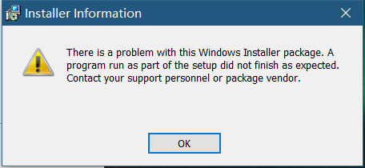

## windows10 安装msi 报错 There is a problem with this Windows Installer package.



通过管理员身份运行cmd，然后输入msiexec /i vpnclient_setup.msi /l*vx vpn.log，命令中的安装包名称替换为你的安装包名称。  
通常很有可能是msi没有获得管理员权限，管理员身份在cmd中运行应该可以成功。  
上述命令会在安装目录输出安装过程的错误，然后找到错误的地方，这样就可以针对性地解决啦  

####刷新本地dns
```cmd
ipconfig /flushdns
```
