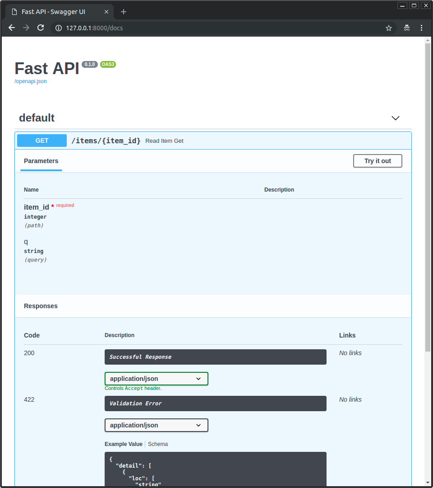

## Installation


```console
$ pip install fastapi
```

```console
$ pip install uvicorn
```

## Example

### Create it

* Create a file `main.py` with:

```Python
from typing import Optional

from fastapi import FastAPI

app = FastAPI()


@app.get("/")
def read_root():
    return {"Hello": "World"}


@app.get("/items/{item_id}")
def read_item(item_id: int, q: Optional[str] = None):
    return {"item_id": item_id, "q": q}
```

### Run it

Run the server with:


```console
$ uvicorn main:app --reload

INFO:     Uvicorn running on http://127.0.0.1:8000 (Press CTRL+C to quit)
INFO:     Started reloader process [28720]
INFO:     Started server process [28722]
INFO:     Waiting for application startup.
INFO:     Application startup complete.
```

### Check it

Open your browser at <a href="http://127.0.0.1:8000/items/5?q=somequery" class="external-link" target="_blank">http://127.0.0.1:8000/items/5?q=somequery</a>.

You will see the JSON response as:

```JSON
{"item_id": 5, "q": "somequery"}
```

You already created an API that:

* Receives HTTP requests in the _paths_ `/` and `/items/{item_id}`.
* Both _paths_ take `GET` <em>operations</em> (also known as HTTP _methods_).
* The _path_ `/items/{item_id}` has a _path parameter_ `item_id` that should be an `int`.
* The _path_ `/items/{item_id}` has an optional `str` _query parameter_ `q`.

### Interactive API docs

Now go to <a href="http://127.0.0.1:8000/docs" class="external-link" target="_blank">http://127.0.0.1:8000/docs</a>.

You will see the automatic interactive API documentation (provided by <a href="https://github.com/swagger-api/swagger-ui" class="external-link" target="_blank">Swagger UI</a>):



### Alternative API docs

And now, go to <a href="http://127.0.0.1:8000/redoc" class="external-link" target="_blank">http://127.0.0.1:8000/redoc</a>.

You will see the alternative automatic documentation (provided by <a href="https://github.com/Rebilly/ReDoc" class="external-link" target="_blank">ReDoc</a>):


## Example upgrade

Now modify the file `main.py` to receive a body from a `PUT` request.

Declare the body using standard Python types, thanks to Pydantic.

```Python
from typing import Optional

from fastapi import FastAPI
from pydantic import BaseModel

app = FastAPI()


class Item(BaseModel):
    name: str
    price: float
    is_offer: Optional[bool] = None


@app.get("/")
def read_root():
    return {"Hello": "World"}


@app.get("/items/{item_id}")
def read_item(item_id: int, q: Optional[str] = None):
    return {"item_id": item_id, "q": q}


@app.put("/items/{item_id}")
def update_item(item_id: int, item: Item):
    return {"item_name": item.name, "item_id": item_id}
```

The server should reload automatically (because you added `--reload` to the `uvicorn` command above).